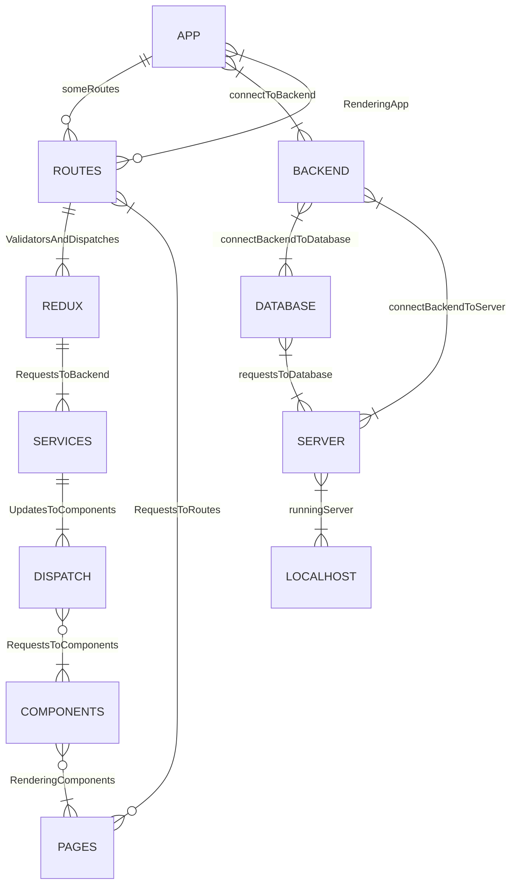

# CRMPS Frontend
## _By Samokhval Stefan_

____

Customer relationship management (CRM) is a technology for managing all your company’s relationships and interactions with customers and potential customers. The goal is simple: Improve business relationships to grow your business. A CRM system helps companies stay connected to customers, streamline processes, and improve profitability.

____

## Features

- Loading Page
- Errors Page
- Sorts
- Animated mesh gradient background

____

## Tech

CRMPS uses a number of open source projects to work properly:

- [Intellij Idea](https://www.jetbrains.com/idea/) - awesome code editor
- [React.js](https://react.dev/) - evented I/O for the frontend
- [MUI](https://mui.com/) - MUI offers a comprehensive suite of UI tools to help you ship new features faster.
- [NextUI](https://nextui.org/) - Beautiful, fast and modern React UI library.
- [Axios](https://axios-http.com/) - Axios is a simple promise based HTTP client for the browser and node.js.
- [Redux](https://redux.js.org/) - A Predictable State Container for JS Apps
- [React hook form](https://react-hook-form.com/) - Performant, flexible and extensible forms with easy-to-use validation.
- [React router dom](https://reactrouter.com/) - It will quickly introduce you to the primary features of React Router: from configuring routes, to loading and mutating data, to pending and optimistic UI.
- [Typescript](https://www.typescriptlang.org/) - strongly typed programming language that builds on JavaScript.

____

## Installation

CRMPS requires [Node.js](https://nodejs.org/) v19.7+ to run.

____

Install the dependencies and devDependencies and start the server via npm.

```sh
cd crmps-frontend
npm i
npm start
```

Or using via yarn

```sh
cd crmps-frontend
yarn install
yarn start
```

____

## Development

Want to contribute? Great!

CRMPS uses nodemon + eslint for fast developing.
Make a change in your file and instantaneously see your updates!

- [X] Backend
    - [X] Pagination
    - [X] Users
    - [X] Comments
    - [X] Group
    - [X] Auth
    - [X] Sort
    - [X] Documentation
    - [X] Swagger

- [X] Frontend
    - [X] Figma mobile design
    - [X] Figma PC design
    - [X] Figma iPad design
    - [X] Main Page
    - [X] Query
    - [X] Details
    - [X] Edit
    - [X] Comments
    - [X] Documentation

## How it works


